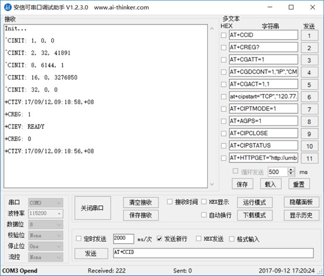

https://docs.ai-thinker.com/gprs

[a9][https://docs.ai-thinker.com/gprs/a9/boards]，[a9g][https://docs.ai-thinker.com/gprs/a9g/boards]

### 模组参数

A9（GSM/GPRS），A9G（GSM/GPRS+GPRS/GPS）。

* 仅支持移动卡

### 开始使用

#### 接线

| USB-TTL | Dev   |
| ------- | ----- |
| RX      | AT_TX |
| TX      | AT_RX |

注：HST_RX & HST_TX 是烧录用的串口。

A9G 具有波特率自适应功能，默认 115200。如 MCU 的波特率是 9600，那么在模组刚上电的时候，发任意 AT 指令，模组就会自动调整波特率到9600。

##### USB供电

| POWER | Dev  |
| ----- | ---- |
| 5V    | VUSB |
| GND   | GND  |

##### 锂电池供电

使用VBAT供电，需长按 `power_key` 2s左右。

| POWER      | Dev  |
| ---------- | ---- |
| 3.3 - 4.2V | VBAT |
| GND        | GND  |

#### 上电

上电打印输出信息：

#### AT 指令调试

示例：https://docs.ai-thinker.com/gprs/examples

连接机智云：https://www.jianshu.com/p/e3d86a263be5

[A9Tracker][https://docs.ai-thinker.com/a9tracker%E7%9B%B8%E5%85%B3%E5%8A%9F%E8%83%BD]

#### 指示灯

|| 状态             | 闪烁间隔 |
|--| --------------- | ---- |
|GPRS| 未注册网络       | 0.5s |
|| 注册网络的过程中 | 0.5s |
|| 注册网络成功     | 2s   |
|GPS（仅A9G）| 没有得到定位 | 0.5s |
|| 得到定位     | 2s   |
